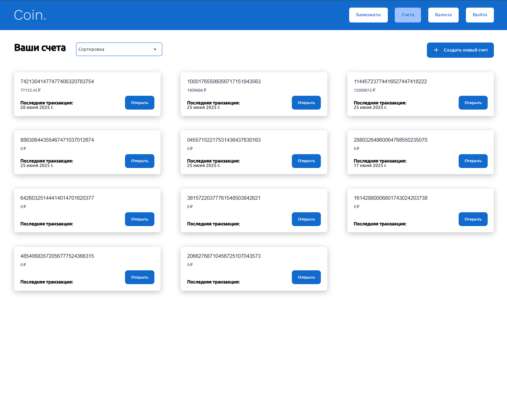

# SPA Банк Coin — Фронтенд

## Описание проекта

Проект представляет собой одностраничное веб-приложение (SPA) для интернет-банка.

Функционал приложения:

- **Авторизация**
- **Управление счетами пользователя: создание нового счета, отображение списка счетов, отображение баланса, просмотр истории транзакций**
- **Переводы на счета или карты других пользователей**
- **Возможность производить валютные обмены**
- **Отображение банкоматов на карте**

Для работы требуется запущенный backend (см. папку `backend/`).

## Скриншоты страниц





## Стек технологий

- **JavaScript (ES6+)**
- **Webpack** - сборка проекта
- **Babel** - транспиляция JS
- **Sass/SCSS** - стилизация
- **Cypress** - e2e тестирование
- **ESLint, Prettier, Stylelint** - линтинг и форматирование кода
- **Chart.js** - библиотека для создания графиков
- **Choices.js** - библиотека для создания кастомного селекта
- **Navigo** - библиотека для роутинга SPA приложений
- **Яндекс.Карты** - для отображения банкоматов на карте (интеграция через JS API, ключ указывается в src/main.html)

## Установка и сборка проекта

1. **Клонируйте репозиторий и перейдите в папку проекта:**

   ```
   $ git clone <адрес-репозитория>
   $ cd <папка-проекта>
   ```

2. **Запустите backend (см. инструкции в `backend/README.md`).**
3. **Установите зависимости:**

   ```
   $ npm install
   ```

4. **Запуск dev-сервера с автоматическим открытием браузера:**

   ```
   $ npm run dev
   ```

   Проект будет собран в режиме разработки, будет запущен виртуальный сервер и открыта страница демонстрации приложения в вашем браузере по адресу [http://localhost:4000](http://localhost:4000). Перед запуском сервер автоматически освободит порт 4000. Для авторизации используйте логин и пароль:

   ```
   login: 'developer',
   password: 'skillbox'
   ```

5. **Сборка для продакшена:**

   ```
   $ npm run build
   ```

   Результат сборки появится в папке `dist/`.

## Запуск тестов и проверка результатов

В проекте используются e2e тесты на Cypress.

1. **Запустите backend (см. инструкции в `backend/README.md`).**
2. **Запустите frontend в режиме разработки:**
   ```
   $ npm run dev
   ```
3. **В отдельном терминале запустите Cypress:**

   ```
   $npx cypress run
   ```

   или для запуска в интерактивном режиме:

   ```
   $ npx cypress open
   ```

   Тесты находятся в папке `cypress/e2e/`.

4. **Проверка результатов:**
   - В консоли вы увидите статус прохождения тестов (успешно/ошибка).
   - В интерактивном режиме можно наблюдать выполнение тестов в браузере.

## Проверка качества кода

- **Линтинг JS:**
  ```
  $ npm run lint
  ```
- **Форматирование и линтинг стилей:**
  - Настройки в `.prettierrc` и `.stylelintrc.json`

---
